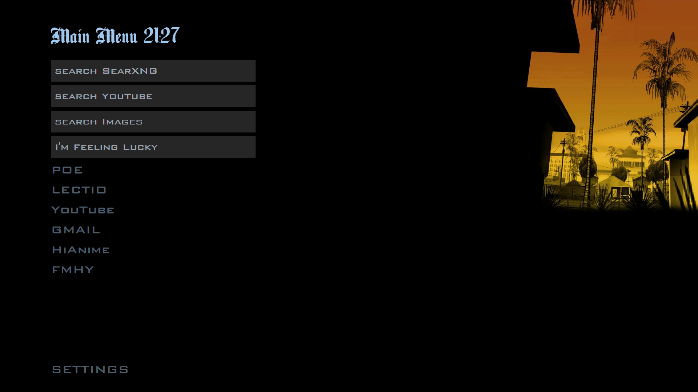
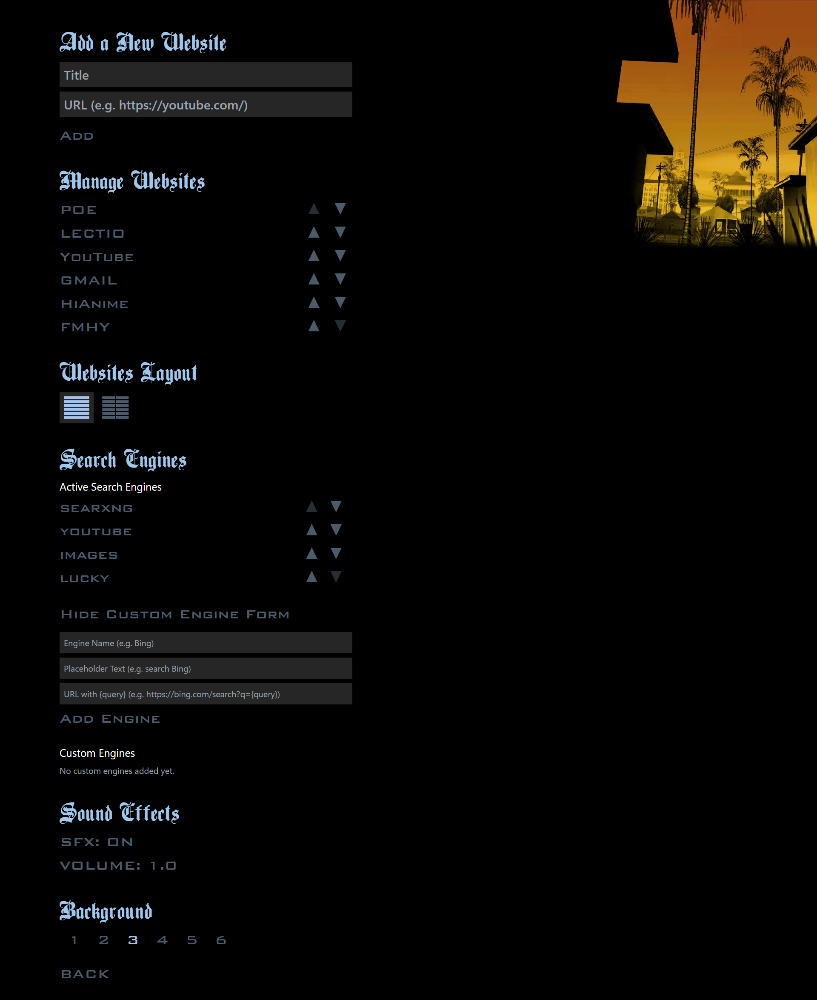

# GTA-SA Menu Startpage
A browser start page inspired by the iconic **GTA San Andreas** menu.

## Settings Preview

> **Live Demo:** [Visit the site here](https://amroelhajj.github.io/gta-sa-startpage/).

## Setup Instructions

To configure it as your new tab page, use the following extensions:

- **Firefox:** [Custom New Tab Page](https://addons.mozilla.org/en-US/firefox/addon/custom-new-tab-page/?src=search)
- **Chromium browsers:** [Custom New Tab URL](https://chrome.google.com/webstore/detail/custom-new-tab-url/mmjbdbjnoablegbkcklggeknkfcjkjia)

You can also build the page locally and customize the design and functionality as you wish.

## Features

- 🎵 Classic menu sound effects
- 🎨 Multiple background options to choose from
- ⬆️ Move up and down in the menu using `jk`, `ws`, or the arrow keys
- 🔍 Integrated search engines
- 🔄 **New:** Reorder websites and search engines
- ✍️ **New:** Ability to add custom search engines
- ⏰ **New:** Added clock to the main menu

## Acknowledgments

All credit for the original design goes to **Rockstar**.  
Shoutout [wjkba](https://github.com/wjkba) for the original project and inspiration for this fork.
